- Step 1: Create new Schema on Mysql after create new Table with the following command:
  CREATE TABLE `Users` (
  `ID` int NOT NULL AUTO_INCREMENT,
  `Name` varchar(45) DEFAULT NULL,
  `Email` varchar(45) DEFAULT NULL,
  `Age` int DEFAULT NULL,
  PRIMARY KEY (`ID`)
  );

- project structure
  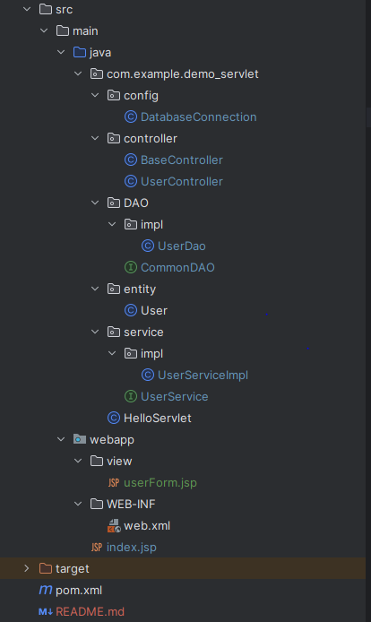 
 +  Config : Chứa các file cấu hình, ở đây anh có class DatabaseConnection chứa các hàm kết nối với cơ sở dữ liệu.
 + Controller: Là các nơi sẽ nhận request từ phía client gửi lên và điều hướng nó tới hàm xử lý phù hợp.
 + DAO: Nơi thao tác với cơ sở dữ liệu: thêm , sửa , xóa , tìm kiếm và map dữ liệu tù database vào class ta cần
 + Entity: Khai báo các class chứa ánh xạ các field giống Table trong DB
 + Service: Nơi xử lí logic , xử lí và truyền yêu cầu tới DB qua DAO
 + webapp : 
   + view : chứa các file jsp hiển thị cho client
   + WEB-INF: file cấu hình url...
 + Pom.xml: khai báo các dependency là các thư viện sử dụng trong dự án

- List All User:
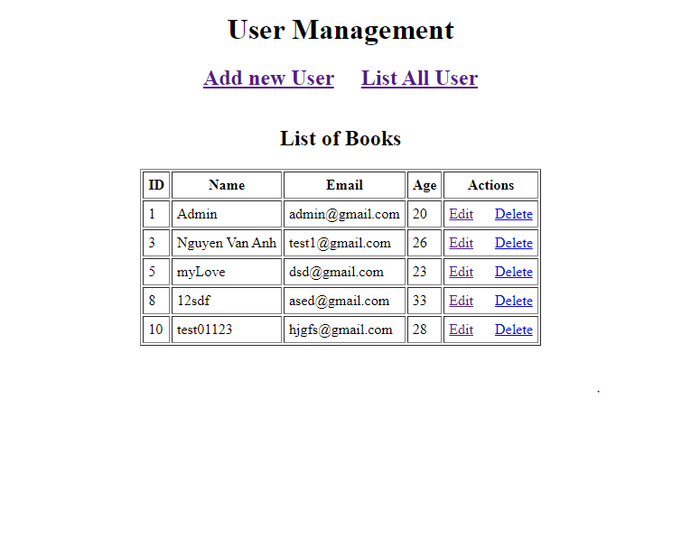

-----------------------------------------------------------------------------------------
- Add new User:
 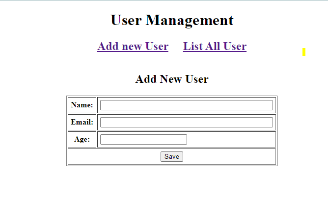
 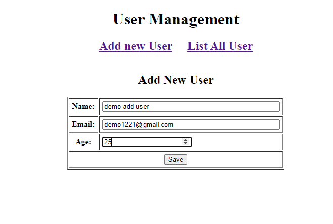
 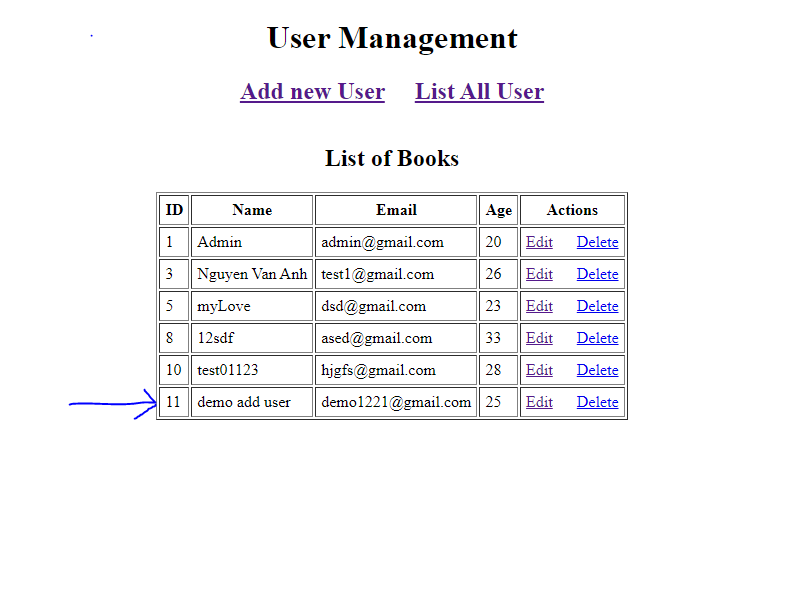

-----------------------------------------------------------------------------------------

- Detail User:
 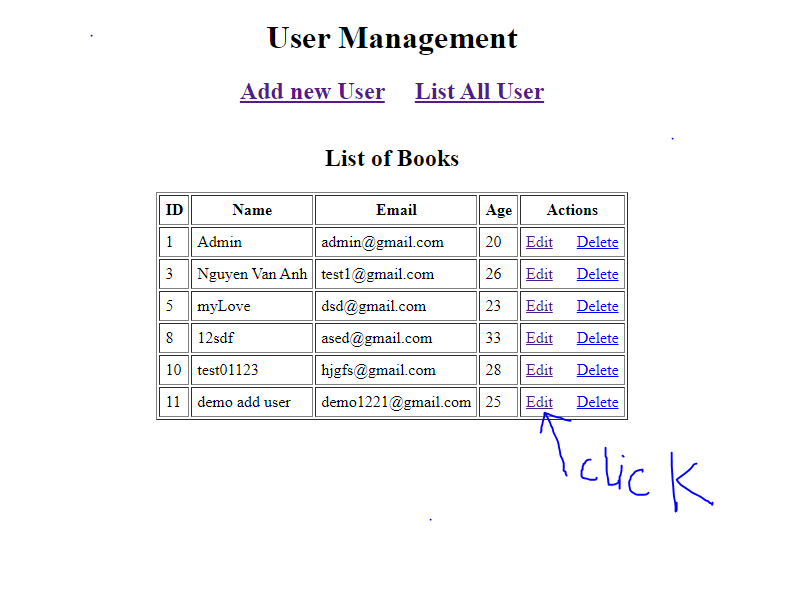
 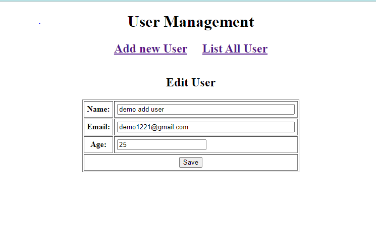

-----------------------------------------------------------------------------------------

- Update User 
 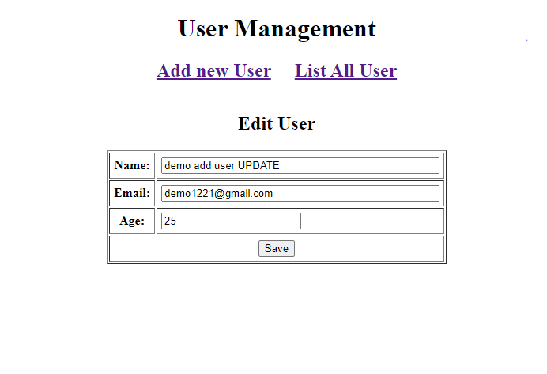
 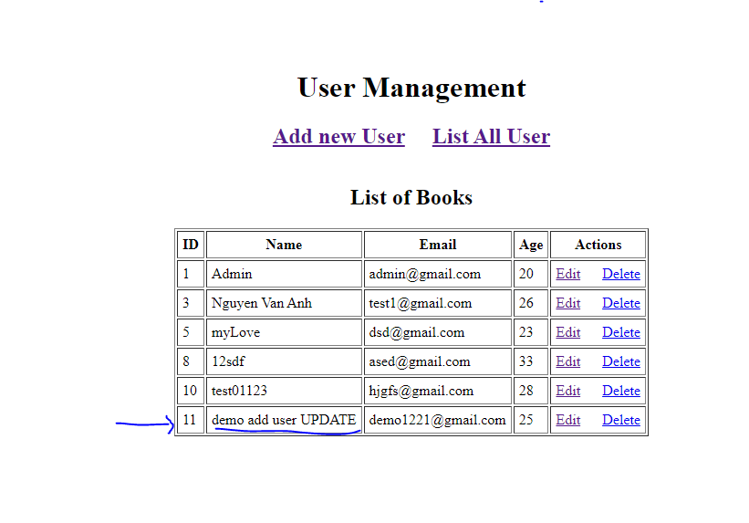

-----------------------------------------------------------------------------------------

- Delete User
 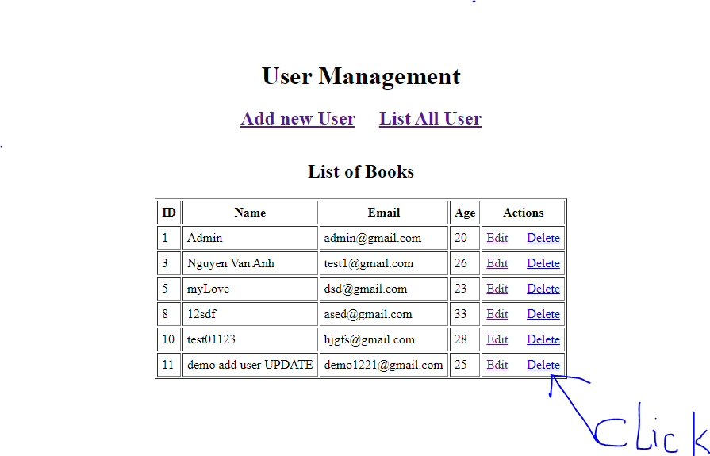
 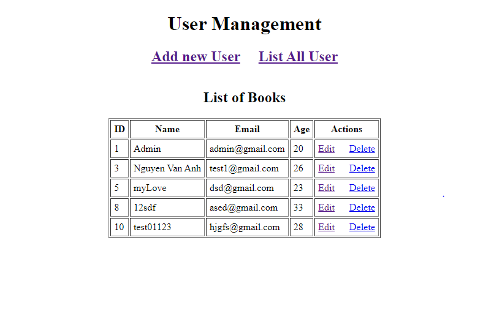

------------------------------------------------------------------------------------------

- Luồng hoạt động: 

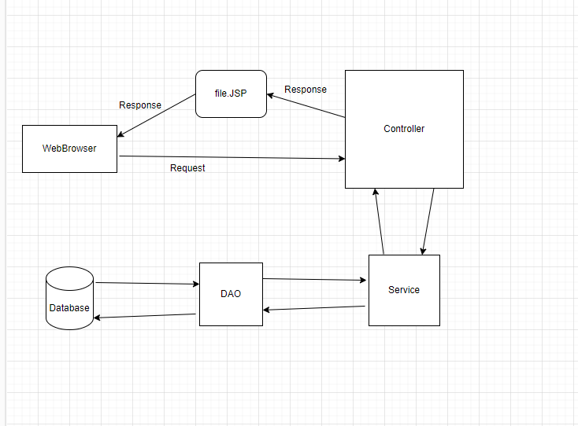

- User gửi request lên controller (theo method: get, post ... , có thể truyền param hay 1 object trong đó)
- Controller nhận request , phân tích xem nó gửi url là gì, phương thức là gì sau đó điều hướng sang hàm xử lý thích hợp trong service
- service: nhận yêu cầu, xử lý yêu cầu: tính toán, công trù... sau đó sẽ gọi sang DAO để thao tác với cơ sở dữ liệu
- DAO: tạo kết nối với Database, khởi tạo câu lệnh sql và truyền tham số nhằm cập nhật thay đổi dữ liệu trong 1 bảng or nhiều bảng trong Database tùy theo yêu cầu
- Database: nơi lưu trữ dữ liệu